# SkillProtocol 🛡️

> **The Universal Standard for Engineering Capability.**
> SkillProtocol is an Agentic Auditor that converts raw GitHub code into **liquid, verified skill credits**. We replace subjective resume scanning with forensic AST parsing, Bayesian probability, and a 6-agent swarm.

---

## 🎯 The Three-Fold Impact

SkillProtocol aligns incentives across the entire engineering ecosystem, solving the "Trust Gap" in technical hiring.

### 1. For Developers: **"Liquid Skills"**

Stop writing resumes that nobody reads. Connect your GitHub, and let our agents mine your commit history to generate a **Cryptographically Signed Certificate**.

* **Benefit:** Convert your late-night coding sessions into **NCrF-standard credits** (National Credit Framework) that act as a universal currency for your expertise.
* **Outcome:** A verified portfolio that proves you can *build*, not just interview.

### 2. For Employers: **"Zero-Trust Hiring"**

Resumes are exaggerated. LeetCode is memorization. SkillProtocol allows you to hire based on **Forensic Evidence**.

* **Benefit:** Verify if a candidate *actually* knows Async/Await patterns, CI/CD pipelines, or microservices architecture by auditing their real-world code.
* **Outcome:** Reduce bad hires by validating practical engineering capability before the first interview.

### 3. For the Ecosystem: **"The Truth Standard"**

We replace subjective opinions with objective, reproducible math.

* **Benefit:** By combining **Tree-sitter AST parsing** with **Bayesian Probability**, we create a universal language for technical skill that translates across borders, universities, and companies.
* **Outcome:** A transparent, meritocratic standard for the software industry.

---

## 🏗️ Architecture: The Agent Swarm

The system is not a simple script. It is an intelligent state machine orchestrated by **LangGraph**, where data flows through a board of specialized AI agents.

```mermaid
flowchart LR
    User[React Frontend] -->|Repo URL| API[FastAPI Gateway]
    API -->|Job ID| Validator
    
    subgraph "The Agent Swarm (LangGraph)"
        Validator[🛡️ Validator] -->|Valid| Scanner[terminal Scanner]
        Scanner -->|AST Metrics| Reviewer[👁️ Reviewer]
        Reviewer -->|Forensics| Grader[⚖️ Grader]
        Grader -->|Assessment| Judge[🧠 Judge]
        
        Judge -->|Verdict| Auditor[✅ Auditor]
        Auditor -->|CI/CD Check| Reporter[📝 Reporter]
    end
    
    Reporter -->|Log Trace| Opik[Opik Observability]
    Reporter -->|Mint Credits| DB[(PostgreSQL)]

```



### The 6-Agent Roles

| Agent | Technology | Responsibility |
| --- | --- | --- |
| **1. Validator** | Regex & GitHub API | **The Gatekeeper.** Validates repository accessibility, checks size limits (to prevent DoS), and detects privacy settings. If a repo is private, it securely requests a token. |
| **2. Scanner** | **Tree-sitter** (C Bindings) | **The Eye.** Clones the repo to a secure sandbox. Parses code into an Abstract Syntax Tree (AST) to count logical nodes (Loops, Classes, Functions) while ignoring whitespace/comments. |
| **3. Reviewer** | Gemini 3 Flash | **The Architect.** Performs semantic analysis on the code structure. Detects design patterns (Singleton, Factory) vs. anti-patterns (God Objects, Hardcoded Secrets). |
| **4. Grader** | SFIA Framework | **The Assessor.** Maps the technical metrics to the **SFIA (Skills Framework for the Information Age)** levels. Determines if the code is Level 1 (Follow) or Level 5 (Ensure). |
| **5. Judge** | **Bayesian Inference** | **The Supreme Court.** Reconciles the Grader's qualitative opinion with the Scanner's quantitative data. If the math says "Level 2" but the LLM says "Level 5", the Judge intervenes to prevent hallucination. |
| **6. Auditor** | GitHub Actions API | **The Skeptic.** Verifies if the code actually runs. Queries CI/CD logs to check build status. If tests fail, it applies a **0.5x penalty** to the final score. |

---

## 🧮 The Scoring Protocol

We use the **NCrF (National Credit Framework)** standard: **30 Learning Hours = 1 Credit**.

### The Core Equation

Our credit calculation is deterministic and transparent:

### 1. Base NCrF ()

Derived from **Tree-sitter** complexity nodes. We estimate "Learning Hours" based on the cognitive load of the code:

* **Simple Logic:** 2 hours / 100 LOC
* **Moderate Logic:** 5 hours / 100 LOC
* **Complex Algorithms:** 10 hours / 100 LOC

### 2. Capability Multiplier ()

Based on the **SFIA Level** assigned by the Judge Agent:

* **Level 1 (Follow):**  (Basic scripting)
* **Level 3 (Apply):**  (Professional baseline)
* **Level 5 (Ensure):**  (Production architecture)

### 3. Quality Multiplier ()

Derived from the Reviewer Agent's forensic analysis:

* **Spaghetti Code:** 
* **Standard Code:** 
* **Clean Architecture:** 

### 4. Reality Multiplier ()

A binary check by the Auditor Agent:

* **Build Passes:** 
* **Build Fails / No CI:**  (Code that doesn't run is worth half)

---

## 🚀 Key Features

* **Polyglot Radar:** A dynamic visualization of your expertise across languages. It normalizes code volume across verbose languages (Java) and dense languages (Python) to show a true skill profile.
* **Protocol Duality:** A stunning UI that adapts to your environment—switching seamlessly between **"Void"** (Cyber-Industrial Dark) and **"Paper"** (Professional Light) modes.
* **Data Flywheel (RLHF):** The system learns. When users "Agree" or "Disagree" with a verdict, the data feeds into the **Opik Optimizer**, creating a feedback loop that retrains our prompts for higher accuracy.
* **Verification Chain:** A transparent UI showing exactly which agent made which decision. Users can see the exact reasoning trace for every credit minted.

---

## 🛠️ Tech Stack

### **Backend (`/backend`)**

* **Framework:** FastAPI (Python 3.11+) - Async, high-performance API.
* **Database:** PostgreSQL (AsyncPG + SQLAlchemy) - Robust, concurrent data storage.
* **Orchestration:** LangChain / LangGraph - State machine for agentic workflows.
* **Analysis:** `tree-sitter` - High-speed, error-tolerant AST parsing.
* **Observability:** Opik - Tracing, evaluation, and prompt optimization.
* **AI Models:** Google Gemini 3 Flash (Reasoning), Groq Llama 3 (Speed).

### **Frontend (`/frontend`)**

* **Framework:** React 19 + Vite - Next-gen frontend performance.
* **Styling:** Tailwind CSS v4 - Semantic variable theming.
* **Animations:** Framer Motion - Smooth, physics-based transitions.
* **Visualization:** Recharts - Professional data visualization components.

---

## ⚡ Getting Started

### Prerequisites

* Python 3.11+
* Node.js 18+
* PostgreSQL Database (Local or Cloud)
* Google Gemini API Key
* Opik (Comet.ml) API Key

### 1. Backend Setup

```bash
cd backend

# Create Virtual Environment
python -m venv .venv
source .venv/bin/activate  # or .venv\Scripts\activate on Windows

# Install Dependencies (includes Tree-sitter bindings)
pip install -r requirements.txt

# Configure Environment
cp .env.example .env
# --> Edit .env with your keys (GEMINI_API_KEY, OPIK_API_KEY, DATABASE_URL)

# Run Migrations
alembic upgrade head

# Start Server
uvicorn app.main:app --reload

```

### 2. Frontend Setup

```bash
cd frontend

# Install Dependencies
npm install

# Start Development Server
npm run dev

```

Visit `http://localhost:5173` to access the Protocol.

---

## 📄 License

Distributed under the MIT License. See `LICENSE` for more information.

<p align="center">
<span style="color: #A1A1AA; font-family: monospace;">SECURED BY SKILLPROTOCOL · OPIK OBSERVABILITY</span>
</p>